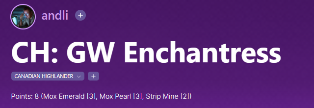

# 🍁 ch_points

Get the current Canadian Highlander points value of a given Moxfield deck straight to your clipboard. The points are sourced from [the official website](https://www.canadianhighlander.ca/points-list/).

## Installation

No need, just run the executable found in the [releases](https://github.com/andli/ch_points/releases) of this repo or build the project yourself.

## Usage
Get the id from the Moxfield URL:
`https://www.moxfield.com/decks/[id]`

Run the executable with the id as argument:
`./ch_points [id]`

Profit:
`Points: 10 (Time Vault [7], Mana Vault [1], Tainted Pact [1], Tolarian Academy [1])`

This text line is put in the clipboard 📋 and can be pasted in the description of your deck on Moxfield:

## Additional functionality
`./ch_points --list` will print the official points list